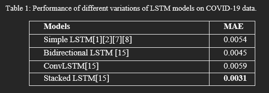
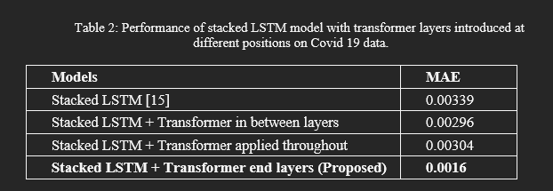
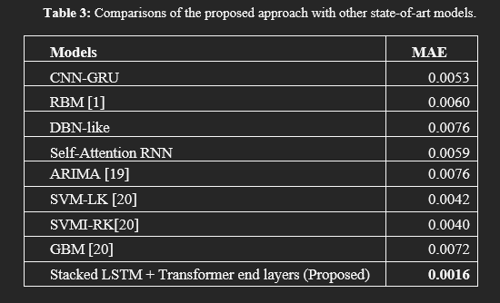

# Time Series Forecasting for COVID-19 Confirmed Cases using Transformer based Stacked LSTM model

## Abstract :
The worldwide impact of COVID-19 necessitates accurate forecasting for informed decision-making by governments and health entities. This study proposes neural network architectures for time series forecasting of confirmed COVID-19 cases based on historical data. The models, including variants of LSTM networks, CNN-GRU hybrids, RBMs, DBNs, and self-attention mechanisms, are trained on comprehensive datasets of confirmed cases, deaths, recoveries, and other variables across various countries. Comparative analysis indicates that CNN-GRU and LSTM models exhibit superior performance in forecasting accuracy, surpassing RBM, DBN, and self-attention models across metrics like Mean Absolute Error and Root Mean Squared Error. This research emphasizes the viability of employing advanced neural networks for precise COVID-19 spread predictions, pivotal in shaping public health policies during global crises.

## Research Summary: Deep Learning for COVID-19 Forecasting

Our research demonstrates that advanced deep neural networks, `specifically LSTM` and `Stacked LSTM Transformer` architectures, provide state-of-the-art performance in multi-step ahead forecasting of COVID-19 epidemiological time series. These models excel in capturing complex spatial and temporal relationships in public health data, achieving significant accuracy improvements over traditional methods like RBMs, DBNs, and self-attention LSTMs.

**Key Findings:**
- **Advanced Architectures:** LSTM and CNN-GRU networks notably reduce forecast errors, outperforming existing models as shown by lower mean absolute error and root mean squared error metrics.
- **Stacked LSTM Transformer:** This novel architecture surpasses baseline LSTM models by better leveraging long-range temporal dependencies through intermediate feature processing layers and attention mechanisms, enhancing forecast precision.
- **Application:** Results support the deployment of these deep learning models in real-world settings, offering actionable insights for public health decision-making during the COVID-19 pandemic.

**Future Directions:**
- Incorporate external factors like public policy changes and human mobility to refine forecasts.
- Continue developing models to support healthcare resource management and viral transmission control strategies.

This research provides crucial insights into optimizing deep learning models for reliable pandemic forecasting, aiding policy makers globally.

## Observations:

